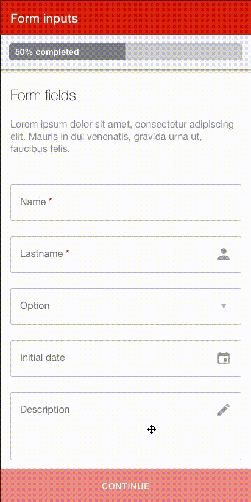

# Components  

This component palette implements the MAPFRE style for some of the most used Angular components. Also, gathers the most used services between apps development.  

The result of applying this custom palette style is an unified UI without an extra effort or CSS copy/paste:  

